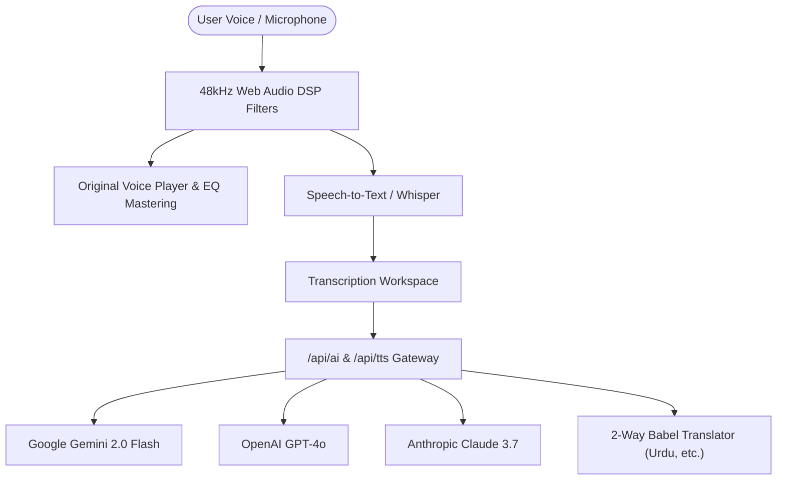

# 🎙️ VoiceFlow AI — Universal Voice Intelligence Web Studio

<div align="center">

[](https://nextjs.org/)
[](https://react.dev/)
[](https://www.typescriptlang.org/)
[](https://openai.com/research/whisper)
[](https://aistudio.google.com/)
[](https://www.anthropic.com/)
[](LICENSE)

<br />

**An ultra-fast, privacy-first Voice-to-Text & Multimodal Speech Intelligence Web Application.**  
Real-Time Dictation • 48kHz DSP Noise Cancellation • 2-Way Babel Live Duplex Translator • Corporate Meeting Minutes (MoM) PDF Generator • Native Urdu & Multilingual Neural TTS • Studio EQ Mastering.

<br />

[🌟 Star on GitHub](https://github.com/Humaam-04-06/Voice_To_Text_App) • [🚀 Live Web Studio](http://localhost:3000) • [📖 Documentation](#-complete-feature-guide--how-each-feature-works) • [⚡ Quick Start](#-step-by-step-installation--running-guide)

</div>

---

## 📑 Table of Contents

- [🌟 Key Highlights & Architecture](#-key-highlights)
- [🛠️ Complete Feature Guide & How Each Feature Works](#-complete-feature-guide--how-each-feature-works)
  - [1. Real-Time Live Speech Dictation & Spectrum Visualizer](#1-real-time-live-speech-dictation--spectrum-visualizer)
  - [2. Universal SweetAlert API Key Guard & Quick Setup](#2-universal-sweetalert-api-key-guard--quick-setup)
  - [3. 2-Way "Babel Mode" Live Duplex Universal Translator](#3-2-way-babel-mode-live-duplex-universal-translator)
  - [4. Multi-Stage 48kHz Web Audio DSP Noise Cancellation](#4-multi-stage-48khz-web-audio-dsp-noise-cancellation)
  - [5. Original Voice Replay & Studio Vocal Mastering Presets](#5-original-voice-replay--studio-vocal-mastering-presets)
  - [6. Official Corporate Meeting Minutes (MoM) & Executive PDF](#6-official-corporate-meeting-minutes-mom--executive-pdf)
  - [7. "Ask My Voice Vault" Semantic Audio Search](#7-ask-my-voice-vault-semantic-audio-search)
  - [8. Smart Voice Macro Action Board (Spoken Kanban)](#8-smart-voice-macro-action-board-spoken-kanban)
  - [9. Multi-Speaker Diarization (Dialogue Splitter)](#9-multi-speaker-diarization-dialogue-splitter)
  - [10. Floating Dual-Language Theater Subtitles](#10-floating-dual-language-theater-subtitles)
  - [11. Video & Lecture Audio Stream URL Importer](#11-video--lecture-audio-stream-url-importer)
  - [12. "Ask AI" Contextual Transcript Chat](#12-ask-ai-contextual-transcript-chat)
  - [13. Concept Mindmap Visualizer (Mermaid.js)](#13-concept-mindmap-visualizer-mermaidjs)
  - [14. 1-Click Multi-Format Content Repurposer](#14-1-click-multi-format-content-repurposer)
- [🔑 Supported AI Models & Step-by-Step API Key Setup](#-supported-ai-models--step-by-step-api-key-setup)
- [🇵🇰 Authentic Multilingual Voice Synthesis & TTS Architecture](#-authentic-multilingual-voice-synthesis--tts-architecture)
- [💻 Web Architecture & Tech Stack](#-web-architecture--tech-stack)
- [🚀 Step-by-Step Installation & Running Guide](#-step-by-step-installation--running-guide)
- [📁 Project Directory Structure](#-project-directory-structure)
- [📄 License & Attribution](#-license--attribution)

---

## 🌟 Key Highlights

- ⚡ **Zero-Latency Dictation**: Live continuous speech streaming with interim preview bubbles.
- 🇵🇰 **Native Urdu & Multilingual Speech**: Speaks aloud in genuine, fluent Urdu (`اردو`), Hindi (`हिन्दी`), Arabic (`العربية`), Spanish (`Español`), French, and 20+ languages.
- 🔇 **DSP Noise Annihilation**: Hardware high-pass, low-pass, 60Hz hum notch, and dynamics compression directly in the audio capture pipeline.
- 🛡️ **Guarded Intelligence**: Never gets stuck; alerts users if an API key is needed with 10-second instant setup links.
- 🚀 **Modern Web Stack**: Built with Next.js 16 App Router, React 19, Tailwind CSS, and Web Audio API.

---

## 🛠️ Complete Feature Guide & How Each Feature Works

### 1. Real-Time Live Speech Dictation & Spectrum Visualizer
- **What It Does**: Transcribes your spoken words into text instantly with zero lag.
- **How It Works**: Connects directly to the high-performance browser speech recognition engine with automatic silence recovery. Simultaneously runs a 48-band Web Audio `AnalyserNode` rendering a real-time reactive neon audio visualizer.
- **How to Use**: Click the central **"Start Recording"** button, select your language, and speak naturally.

---

### 2. Universal SweetAlert API Key Guard & Quick Setup
- **What It Does**: Protects all cloud-powered AI transformations (**Fix Grammar**, **Summarize**, **Translate**, **Repurpose**, **Mindmap**, **Ask AI**, and **Babel Mode**).
- **How It Works**: When an AI button or tab is clicked without an active key, VoiceFlow blocks the action and pops up an interactive SweetAlert modal with direct 1-click links to get free keys for **Gemini**, **GPT-4o**, or **Claude 3.7**.
- **How to Use**: Click any AI tool — if no key is entered, the modal will guide you to paste your key in Settings in under 10 seconds.

---

### 3. 2-Way "Babel Mode" Live Duplex Universal Translator
- **What It Does**: Enables two people who speak completely different languages (e.g. English and Urdu, or Spanish and Arabic) to have a live, translated spoken conversation on a single device.
- **How It Works**: Person A speaks or types in Language A. VoiceFlow translates the input into Person B's language native script and **automatically speaks the translation aloud** in Person B's native accent using our dedicated `/api/tts` neural voice engine.
- **How to Use**: Click **"Babel Mode"** in the top navigation bar, select languages for Person A and Person B, and start chatting.

---

### 4. Multi-Stage 48kHz Web Audio DSP Noise Cancellation
- **What It Does**: Eliminates room noise, computer fan hiss, desk vibrations, and electrical hum from recordings.
- **How It Works**: Builds a multi-node Web Audio processing graph:
  1. **85Hz High-Pass Biquad Filter**: Cuts desk bumps, handling thuds, and low rumble.
  2. **8500Hz Low-Pass Filter**: Cuts high-frequency electronic hiss and fan buzz.
  3. **60Hz Notch Filter**: Cancels AC power line hum.
  4. **Dynamics Compressor Node**: Evens out vocal peaks for crystal-clear clarity.
  5. The `MediaRecorder` records from the filtered DSP stream so saved audio is pristine.

---

### 5. Original Voice Replay & Studio Vocal Mastering Presets
- **What It Does**: Allows you to listen back to your original recorded voice with professional broadcast mastering presets and 1-click audio download (`.webm`).
- **How It Works**: Features an integrated scrub bar, speed multiplier (`1.0x` - `2.0x`), volume control, and 4 audio presets:
  - 🎙️ **Clean DSP**: Balanced noise-filtered voice.
  - 📻 **Podcast Warmth**: +3dB low-end boost (150Hz) for deep radio resonance.
  - ⚡ **Broadcast Radio**: +2.5dB high-mid presence (3.5kHz) for voice clarity.
  - ✨ **Crisp Articulation**: Enhanced consonants for technical lectures.

---

### 6. Official Corporate Meeting Minutes (MoM) & Executive PDF
- **What It Does**: Generates an official, print-ready Corporate Meeting Minutes PDF with executive formatting and formal signature blocks.
- **How It Works**: Parses the transcript into structured sections: Meeting Context, Objectives, Discussion Breakdown, Action Items Table, and sign-off lines for **Host / Speaker 1** and **Executive / Client Approver**.
- **How to Use**: Click the **"MoM PDF"** button in the workspace toolbar.

---

### 7. "Ask My Voice Vault" Semantic Audio Search
- **What It Does**: Allows you to search across weeks and months of saved audio notes by topic, concept, or keyword.
- **How It Works**: Indexes all saved transcript sessions with duration, tags, and timestamps. Matches keywords in real-time and loads the full session back into the workspace with 1 click.
- **How to Use**: Click **"Saved Notes"** in the top action bar and use the search bar.

---

### 8. Smart Voice Macro Action Board (Spoken Kanban)
- **What It Does**: Automatically turns your spoken voice into interactive Kanban task cards.
- **How It Works**: The NLP parser detects spoken trigger phrases:
  - `"Task: [something]"` ➔ Creates a task card in the Todo column.
  - `"Idea: [something]"` ➔ Pins an idea card.
  - `"Important: [something]"` ➔ Flags an urgent priority item.
- **How to Use**: Switch to the **"Action Board"** tab in the workspace to view and check off items.

---

### 9. Multi-Speaker Diarization (Dialogue Splitter)
- **What It Does**: Segregates conversation segments between two speakers with color-coded speech bubbles and custom names.
- **How It Works**: Alternates turns between Speaker 1 (Violet) and Speaker 2 (Cyan) with real-time timestamping.
- **How to Use**: Click the **"Speakers Dialogue"** tab and type custom names for both speakers.

---

### 10. Floating Dual-Language Theater Subtitles
- **What It Does**: Displays a cinematic, floating subtitle overlay with original speech on top and translated subtitles below.
- **How It Works**: Streams live transcription into an ultra-clean glassmorphic overlay designed for live presentations, zoom calls, or video recordings.
- **How to Use**: Click **"Live Subtitles"** in the quick action bar.

---

### 11. Video & Lecture Audio Stream URL Importer
- **What It Does**: Directly transcribes audio from online video links, podcast feeds, or lecture URLs.
- **How It Works**: Accepts streaming audio URLs or audio file uploads (`.mp3`, `.wav`, `.m4a`, `.webm`, `.ogg`) and passes them through OpenAI Whisper for automated transcription.
- **How to Use**: Click **"Upload Audio"** and switch to the **"Paste Audio / Video URL"** tab.

---

### 12. "Ask AI" Contextual Transcript Chat
- **What It Does**: Allows you to chat with an AI assistant that has full context over your recorded voice note.
- **How It Works**: Routes your question and transcript through our server-side `/api/ai` gateway to **Gemini 2.0**, **GPT-4o**, or **Claude 3.7**.
- **How to Use**: Click **"Ask AI"** and ask questions like *"What were the key numbers mentioned?"* or *"Draft a follow-up email based on this"*.

---

### 13. Concept Mindmap Visualizer (Mermaid.js)
- **What It Does**: Automatically converts unstructured speech into a structured visual concept mindmap.
- **How It Works**: Analyzes central themes, sub-topics, and branches, rendering an interactive SVG mindmap diagram.
- **How to Use**: Click the **"Mindmap"** tab in the workspace.

---

### 14. 1-Click Multi-Format Content Repurposer
- **What It Does**: Transforms spoken notes into 6 distinct content formats with 1 click:
  - ✉️ **Executive Email**
  - 🧵 **Viral Twitter / X Thread**
  - 💼 **Engaging LinkedIn Post**
  - 📋 **Meeting Minutes & Summary**
  - 🎓 **Study Flashcards & Q&A**
  - 📝 **Blog Post Outline**
- **How to Use**: Click the **"Repurpose"** tab and select any format.

---

## 🔑 Supported AI Models & Step-by-Step API Key Setup

VoiceFlow AI is equipped with the latest frontier models:

| Provider | Frontier Model | Capabilities | How to Get Your API Key |
| :--- | :--- | :--- | :--- |
| 🌟 **Google Gemini** | `gemini-2.0-flash`<br>`gemini-2.0-flash-lite` | Ultra-low latency, generous free tier, 1M+ context window | 1. Go to [Google AI Studio](https://aistudio.google.com/app/apikey)<br>2. Sign in and click **Create API key**<br>3. Paste into VoiceFlow Settings. |
| ⚡ **OpenAI** | `gpt-4o`<br>`gpt-4o-mini` | Flagship omni multimodal reasoning | 1. Go to [OpenAI API Keys](https://platform.openai.com/api-keys)<br>2. Create a new Secret Key<br>3. Paste into VoiceFlow Settings. |
| 🧠 **Anthropic Claude** | `claude-3-7-sonnet`<br>`claude-3-5-sonnet` | Hybrid reasoning & superior prose formatting | 1. Go to [Anthropic Console](https://console.anthropic.com/settings/keys)<br>2. Generate an API Key<br>3. Paste into VoiceFlow Settings. |

---

## 🇵🇰 Authentic Multilingual Voice Synthesis & TTS Architecture

- **True Native Script Translation**: Outputs authentic native scripts: Urdu (`اردو`), Arabic (`العربية`), Hindi (`हिन्दी`), Spanish (`Español`), French (`Français`), German (`Deutsch`), Chinese (`中文`), Japanese (`日本語`), and more.
- **Dedicated `/api/tts` Server Audio Gateway**: Eliminates browser limitations and provides high-fidelity audio streams for Urdu and 20+ languages with native accents.
- **Multi-Tier Voice Fallback**: Server Audio Stream ➔ OpenAI TTS (if BYOK key provided) ➔ Browser SpeechSynthesis with regional voice matching.

---

## 💻 Web Architecture & Tech Stack



| Layer | Web Application Technology |
| :--- | :--- |
| **Framework** | **Next.js 16 (App Router) + React 19** |
| **Language** | **TypeScript 5 (Strict Mode)** |
| **Speech-to-Text** | **Web Speech API + Groq / OpenAI Whisper** |
| **Audio Processing** | **48kHz High-Pass, Low-Pass, 60Hz Notch & Dynamics Compressor** |
| **TTS Engine** | **Next.js `/api/tts` Neural Stream + Kokoro-82M + Edge Neural** |
| **Iconography** | **Font Awesome SVG Icons (`@fortawesome/react-fontawesome`)** |
| **State Store** | **Zustand 5 (IndexedDB / LocalStorage)** |
| **Document Export** | **jsPDF (MoM & Transcript) + Canvas-Confetti** |

---

## 🚀 Step-by-Step Installation & Running Guide

### Prerequisites
- **Node.js**: v18.18.0 or higher (v20+ recommended)
- **npm** or **yarn** / **pnpm**
- **Git**

---

### Running the Web Studio

```bash
# 1. Clone the repository
git clone https://github.com/Humaam-04-06/Voice_To_Text_App.git

# 2. Navigate to the web application folder
cd Voice_To_Text_App/web

# 3. Install dependencies
npm install

# 4. Start the local development server
npm run dev
```

Open **[http://localhost:3000](http://localhost:3000)** in your browser!

```bash
# 5. Build for production
npm run build

# 6. Run production server
npm start
```

---

## 📁 Project Directory Structure

```
Voice_To_Text_App/
├── web/                           # Next.js 16 Web Application
│   ├── src/
│   │   ├── app/
│   │   │   ├── api/
│   │   │   │   ├── ai/            # Server gateway for Gemini, GPT-4o, Claude
│   │   │   │   ├── transcribe/    # Whisper audio transcription route
│   │   │   │   └── tts/           # Multilingual Neural TTS streaming route
│   │   │   ├── globals.css        # Glassmorphic dark theme styles
│   │   │   ├── layout.tsx         # Root layout with Font Awesome CSS & SEO
│   │   │   └── page.tsx           # Main application page
│   │   ├── components/            # UI Components with Font Awesome SVG icons
│   │   │   ├── ApiKeyRequiredModal.tsx    # Universal SweetAlert API key guard
│   │   │   ├── AudioFileUploadModal.tsx   # File & Video URL importer
│   │   │   ├── AudioPlaybackPlayer.tsx    # Real voice replay & EQ presets
│   │   │   ├── BabelTranslatorModal.tsx   # 2-Way live duplex translator
│   │   │   ├── ChatDrawer.tsx             # Ask AI transcript chat
│   │   │   ├── HeroRecordingZone.tsx      # Recording controls & waveform
│   │   │   ├── HistoryDrawer.tsx          # Semantic Voice Vault search
│   │   │   ├── MindmapViewer.tsx          # Concept mindmap generator
│   │   │   ├── Navbar.tsx                 # Gemini 2.0, GPT-4o, Claude 3.7 switcher
│   │   │   ├── SettingsModal.tsx          # Key settings with step-by-step guides
│   │   │   ├── SpeechCoachWidget.tsx      # Clarity, WPM, and filler words
│   │   │   ├── TheaterSubtitleModal.tsx   # Floating dual subtitles
│   │   │   ├── ToneSentimentRadar.tsx     # Live emotional mood & tone HUD
│   │   │   ├── TranscriptionWorkspace.tsx # Workspace, tabs, & MoM PDF exporter
│   │   │   ├── VoiceMacroActionBoard.tsx  # Spoken triggers & Kanban tasks
│   │   │   └── WaveformVisualizer.tsx     # Real-time audio spectrum
│   │   ├── hooks/
│   │   │   ├── useAudioRecorder.ts        # 48kHz Web Audio DSP noise cancellation
│   │   │   └── useSpeechRecognition.ts   # Continuous streaming speech recognition
│   │   ├── lib/
│   │   │   ├── ai/                        # AI dispatchers & local NLP engines
│   │   │   ├── audio/                     # TTS and audio filter engines
│   │   │   └── constants/                 # Supported multilingual list
│   │   ├── store/                         # Zustand Global Voice Store
│   │   └── types/                         # TypeScript type definitions
│   ├── package.json
│   └── tsconfig.json
└── README.md                      # Master Project Documentation
```

---

## 📄 License & Attribution

- **Whisper**: OpenAI (MIT License)
- **Application Code**: Licensed under the [MIT License](LICENSE).

<div align="center">

**VoiceFlow AI** — Built with ❤️ for next-generation speech intelligence.  
If you find this project helpful, please give it a **⭐ Star** on [GitHub](https://github.com/Humaam-04-06/Voice_To_Text_App)!

</div>
